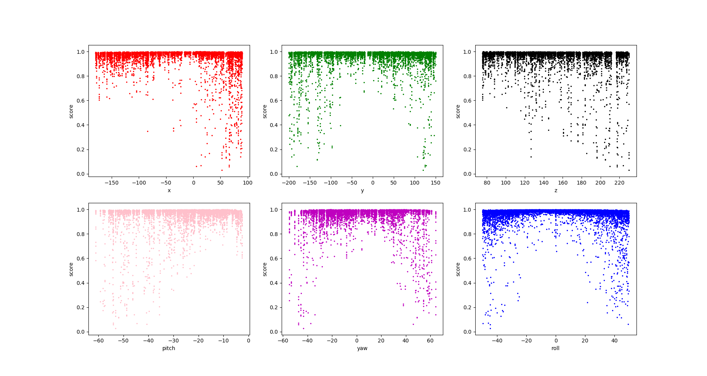

This repo contains some experiments with the unrealcv and relative gym-unrealcv.

## Things I added:

* Integrate tensorflow faster rcnn implements, [smallcorgi/Faster-RCNN_TF](https://github.com/smallcorgi/Faster-RCNN_TF) with unrealcv.
* Give a instinctive example of how the 6-dof relative translations and rotations affect the Faster-RCNN_TF's results.

More info can be found at [generate_images_design.md](generate_images_design.md) and codes in this folder.

The installation and environments set up can be found at [installation_and_set_up.md](installation_and_set_up.md)

## TODO

Implements new DQN experiments to better use this library.
