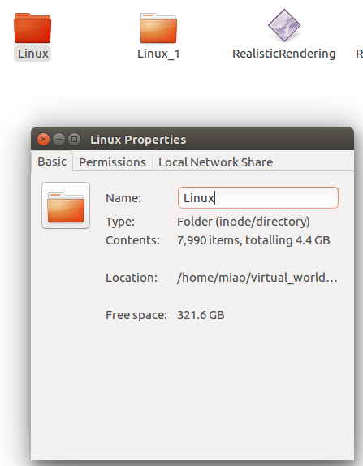

The images we want to generate is pretty simple, we want images have the `Couch_13` as the dominate scene. And the positions and rotations vary, the purpose is to generate a dataset to evaluate existing algorithms' ability for position and/or rotation change. After hand chosen, we got that:

``` vi
Lower center:
loc = [-18.0, 0.0, 90.0]
rot = [0.0, 0.0, 0.0]

Lower left:
12.000 -200.000 100.000
0.000 42.000 0.000

Lower right:
7.000 150.000 90.000
0.000 -41.000 0.000

Higher center:
-18.000 -15.000 205.000
-32.000 0.000 0.000

Higher left:
27.000 -155.000 205.000
-32.000 42.000 0.000

Higher right:
57.000 150.000 230.000
-39.000 -40.000 0.000
```


And to be more specific, these can be:

``` vi
The couch
180.000 0.000 60.000
0.000 -180.000 0.000
```

So, we give a rough range to do subsample:

``` vi
x:[-180,90]
y:[-200,150]
z:[75,230]

And we choose points from a 1/4 sphere, then point to the [180.000 0.000 60.000], and adjust the rotation and translation so that the sofa(couch) occupies a large space.
```

## How to generate datasets

### the location

We choose that space through `randrange`.

``` python
xs = randrange(n, xlow, xhigh)
ys = randrange(n, ylow, yhigh)
zs = randrange(n, z_min, z_max)
ax.scatter(xs, ys, zs, c=c, marker=m)
```

### the rotation

To calc the pitch/yaw/roll, we use the angel calculation method from [https://stackoverflow.com/a/13849249/71522](https://stackoverflow.com/a/13849249/71522), just calc the pitch and yaw first. Then, for roll, we randomly choose from a range, say [-50,50] or so.

## All in one

Code can be found at [generate_images_traj.py](generate_images_traj.py).

The time to generate images is pretty appealing:

``` vi
ᐅ python generate_images_unrealcv.py 
Total number: 8000
INFO:__init__:204:Got connection confirm: 'connected to RealisticRendering'
2017-06-16 01:02:35
1497546156.0
0/8000 ... 2017-06-16 01:02:35
100/8000 ... 2017-06-16 01:03:04
200/8000 ... 2017-06-16 01:03:32
300/8000 ... 2017-06-16 01:03:59
400/8000 ... 2017-06-16 01:04:29

[...]

7600/8000 ... 2017-06-16 01:37:17
7700/8000 ... 2017-06-16 01:37:42
7800/8000 ... 2017-06-16 01:38:07
7900/8000 ... 2017-06-16 01:38:33
2017-06-16 01:38:58
1497548338.49
Duration:2182.49328804s
```

So, it spent around 2182/60=36.37 minutes to generate 8000 images, much more quicker than in real environments. The files are around 4.4GB.



And what's more, this experiments is repeatable.

## How to evaluate the algorithm


We will run the [smallcorgi/Faster-RCNN_TF](https://github.com/smallcorgi/Faster-RCNN_TF) with all the images and record it's score of the confidences of locating `sofa`. Codes can be found at [faster_rcnn_test_sofa.py](faster_rcnn_test_sofa.py).


``` vi
Loaded network /home/miao/virtual_world/codes/faster_rcnns/Pretrained/VGGnet_fast_rcnn_iter_70000.ckpt
Init_tf done
init network done
Total number: 8000
0/8000 ... 2017-06-16 02:00:59
50/8000 ... 2017-06-16 02:01:10
100/8000 ... 2017-06-16 02:01:20
150/8000 ... 2017-06-16 02:01:30
200/8000 ... 2017-06-16 02:01:40

[...]


```


## The evaluation

